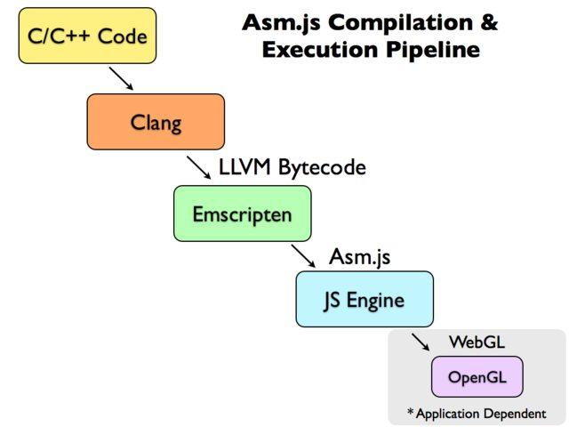

Asm.js: The JavaScript Compile Target
===
期待已久的Asm.js终于出来了，我也像许多开发者一样激动不已。你要是对此感兴趣，想要了解更多近期的信息请访问[Asm.js is now in Firefox nightly ](https://blog.mozilla.org/luke/2013/03/21/asm-js-in-firefox-nightly/)。这里也有大量你所感兴趣的资料[ Mozilla and Epic announced](https://blog.mozilla.org/blog/2013/03/27/mozilla-is-unlocking-the-power-of-the-web-as-a-platform-for-gaming/)，而且他们已经把虚拟引擎3（Unreal Engine 3）移植到了Asm.js上了-并且它运行的很好。

Asm.js通过使用WebGL渲染，能让一个基于C++引擎的游戏运行在JavaScript上面，这是一个非常大的壮举，而且很大程度上是因为有大量的工具链才能让Mozilla的开发人员将它变为可能。

自从发布了Asm.js的虚拟引擎3接口后，我就一直从Twitter,博客和其它一些地方关注着大家对此的反应，而一些开发者通过自己掌握的公开技术将它们有趣的结合在一起，并且已经取得了一些进步，同时也帮我解决了许多的困惑，比如:Asm.js是一个插件吗？Asm.js是否真能定期的使我的JavaScript变快？是否能在所有的浏览器中工作？我觉得Asm.js能够把这些技术相关联起来是一件非常了不起的事。我也试着通过我自己对它的一些理解来告诉大家Asm.js是怎么实现的以及它能给大家带来什么好处。同时在我这篇简短的研究报告中，我也问了[David Herman](http://calculist.org/)（Mozilla研究院高级研究员）一个关于Asm.js是怎样把各个零件都连在一起的问题。

什么是Asm.js?
---
在理解Asm.js之前，你需要先知道它安装在浏览器中的什么地方和它来自哪里以及为什么存在。

Asm.js是JavaScript应用程序中的一个新的分类:C/C++应用程序通过JavaScript进行编译。它是整个JavaScript应用程序中的一个新的类型，并由[Mozilla Emscripten 项目](https://github.com/kripken/emscripten)发起。

Emscripten通过LLVM将C/C++代码转换生成LLVM字节码并放在JavaScript中运行（特别说明下，Asm.js是JavaScript的一个子集）。

如果编译Asm.js代码去做一些执行过程中的渲染的话，那么大部分情况很可能都是通过WebGL来负责实现的（已经渲染的则使用OpenGL来实现）。在这种方法中，整个过程在技术上使用了JavaScript和浏览器，但是几乎绕过了整个真实的，正常的代码执行过程，并获取一个网页中的js渲染路径。

因为Asm.js是JavaScript的一个子集，因此它在操作使用上都会极大的受限。但是，也正因为如此，让Asm.js能够直接转换Asm.js代码到集合中，从而使代码可以运行尽可能快做尽可能少的假设（assumptions）。这里需要重点解释下，Asm.js只是一个JavaScript - 它并不是浏览器的一个特殊的插件也不需要你手动配置使其生效（尽管浏览器也能检测并优化Asm.js代码，也确实能使其速度运行的更快）。它只是一个JavaScript的子集专门用来优化其性能的。特别说明下，本例中的应用程序是使用JavaScript编译的。

想要了解Asm.js工作原理和一些限制条件，最好的方法就是去看一些Asm.js编译源码。让我们来看一个现实中的Asm.js编译模块中的函数（来自于BananaBread的例子）。我已经格式化了这些代码让其在文章摘要中显得稍微有条理一点 - 代码是正确的只是相对于现在已经大量简化的JavaScript代码来说稍显庞大些。

	function Vb(d) {
	d = d | 0;
	var e = 0, f = 0, h = 0, j = 0, k = 0, l = 0, m = 0, n = 0,
		o = 0, p = 0, q = 0, r = 0, s = 0;
	e = i;
	i = i + 12 | 0;
	f = e | 0;
	h = d + 12 | 0;
	j = c[h >> 2] | 0;
	if ((j | 0) > 0) {
		c[h >> 2] = 0;
		k = 0
	} else {
		k = j
	}
	j = d + 24 | 0;
	if ((c[j >> 2] | 0) > 0) {
		c[j >> 2] = 0
	}
	l = d + 28 | 0;
	c[l >> 2] = 0;
	c[l + 4 >> 2] = 0;
	l = (c[1384465] | 0) + 3 | 0;
	do {
		if (l >>> 0 < 26) {
			if ((4980736 >>> (l >>> 0) & 1 | 0) == 0) {
				break
			}
			if ((c[1356579] | 0) > 0) {
				m = d + 4 | 0;
				n = 0;
				while (1) {
					o = c[(c[1356577] | 0) + (n << 2) >> 2] | 0;
					do {
						if (a[o + 22 | 0] << 24 >> 24 == 24) {
							if (!(Vp(d, o | 0) | 0)) {
								break
							}
							p = (c[m >> 2] | 0) + (((c[h >> 2] | 0) - 1 | 0) * 40 & -1) + 12 | 0;
							q = o + 28 | 0;
							c[p >> 2] = c[q >> 2] | 0;
							c[p + 4 >> 2] = c[q + 4 >> 2] | 0;
							c[p + 8 >> 2] = c[q + 8 >> 2] | 0;
							c[p + 12 >> 2] = c[q + 12 >> 2] | 0;
							c[p + 16 >> 2] = c[q + 16 >> 2] | 0;
							c[p + 20 >> 2] = c[q + 20 >> 2] | 0;
							c[p + 24 >> 2] = c[q + 24 >> 2] | 0
						}
					} while (0);
					o = n + 1 | 0;
					if ((o | 0) < (c[1356579] | 0)) {
						n = o
					} else {
						break
					}
				}
				r = c[h >> 2] | 0
			} else {
				r = k
			} if ((r | 0) == 0) {
				i = e;
				return
			}
			n = c[j >> 2] | 0;
			if ((n | 0) >= 1) {
				i = e;
				return
			}
			m = f | 0;
			o = f + 4 | 0;
			q = f + 8 | 0;
			p = n;
			while (1) {
				g[m >> 2] = 0.0;
				g[o >> 2] = 0.0;
				g[q >> 2] = 0.0;
				Vq(d, p, f, 0, -1e3);
				n = c[j >> 2] | 0;
				if ((n | 0) < 1) {
					p = n
				} else {
					break
				}
			}
			i = e;
			return
		}
	} while (0);
	if ((c[1356579] | 0) <= 0) {
		i = e;
		return
	}
	f = d + 16 | 0;
	r = 0;
	while (1) {
		k = c[(c[1356577] | 0) + (r << 2) >> 2] | 0;
		do {
			if (a[k + 22 | 0] << 24 >> 24 == 30) {
				h = b[k + 14 >> 1] | 0;
				if ((h - 1 & 65535) > 1) {
					break
				}
				l = c[j >> 2] | 0;
				p = (c[1384465] | 0) + 3 | 0;
				if (p >>> 0 < 26) {
					s = (2293760 >>> (p >>> 0) & 1 | 0) != 0 ? 0 : -1e3
				} else {
					s = -1e3
				} if (!(Vq(d, l, k | 0, h << 16 >> 16, s) | 0)) {
					break
				}
				g[(c[f >> 2] | 0) + (l * 112 & -1) + 56 >> 2] = +(b[k + 12 >> 1] << 16 >> 16 | 0);
				h = (c[f >> 2] | 0) + (l * 112 & -1) + 60 | 0;
				l = k + 28 | 0;
				c[h >> 2] = c[l >> 2] | 0;
				c[h + 4 >> 2] = c[l + 4 >> 2] | 0;
				c[h + 8 >> 2] = c[l + 8 >> 2] | 0;
				c[h + 12 >> 2] = c[l + 12 >> 2] | 0;
				c[h + 16 >> 2] = c[l + 16 >> 2] | 0;
				c[h + 20 >> 2] = c[l + 20 >> 2] | 0;
				c[h + 24 >> 2] = c[l + 24 >> 2] | 0
			}
		} while (0);
		k = r + 1 | 0;
		if ((k | 0) < (c[1356579] | 0)) {
			r = k
		} else {
			break
		}
	}
	i = e;
	return
	}

虽然从技术角度来讲这是一个JavaScript代码，但是从代码中我们可以看到，它并不像平常我们使用JavaScript操作DOM那样来使用的。这不重要，重要的是我们只需从代码中关注几点信息：

这份特殊的代码只是用来处理数字。实际上这是所有Asm.js的案例代码。Asm.js只是在处理选择不同的数字类型时和不同的数据结构上比较出色（这里包括了字符串，布尔型和对象）。

所有外部数据都会被存储和引用来自于单个对象中，最后被累积起来调用。本质上这里的累积指的是大量的数组（故意变成数组类型，是为了在性能上获得高度的优化）