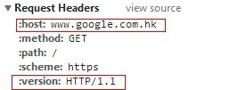

HTTP 1.1 头信息 host 的作用
===
我们知道一台服务器只有一个IP，但我们可以申请多个域名。当你有多个网站都放在同一台服务器上时，那么服务器是如何判断你是要访问哪个网站的呢？这就需要通过host信息告诉服务器（apache、nginx）用户在浏览器中输入的是哪个网站，服务器就会去对应的目录下查找。

注：如果你用的是SSH协议（即https），那么该方法是没用的，因为SSH会加密头信息，使得服务器无法判断host是指向谁。